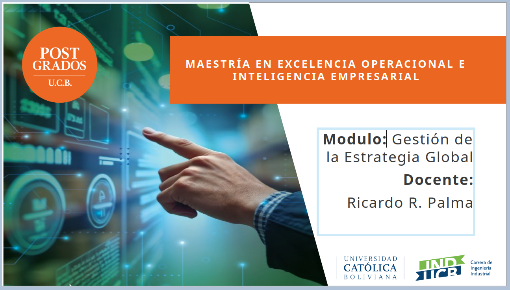

# Maestría en Excelencia Operacional

## Universidad Carólica Boliviana (San Pablo)

### Módulo Estrategia de Manufactura Global

Docente: Prof. Ricardo R. Palma (PhD)

Agenda

[Plan Módulo DES501](https://github.com/ricardorpalma/Excelencia_Operacional_UCB/blob/main/plan_modulo_DES501_sugerido.pdf)

[historia_estrategia_manufactura](historia_estrategia_manufactura.md)

[Introducción a la estrategia de Manufactura Global](https://github.com/ricardorpalma/Excelencia_Operacional_UCB/blob/main/Introducci%C3%B3n%20a%20la%20estrategia%20de%20Manufactura%20Global.md)

[Modelos y marcos de referencia para manufactura global]([Modelos y marcos de referencia para manufactura global.md)
